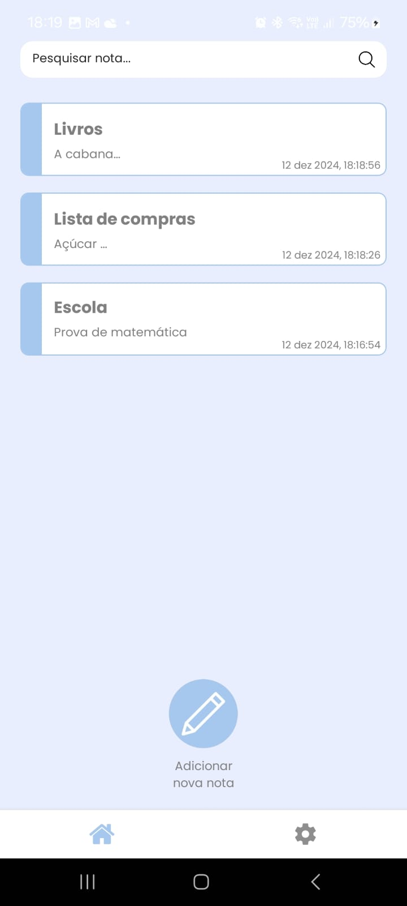
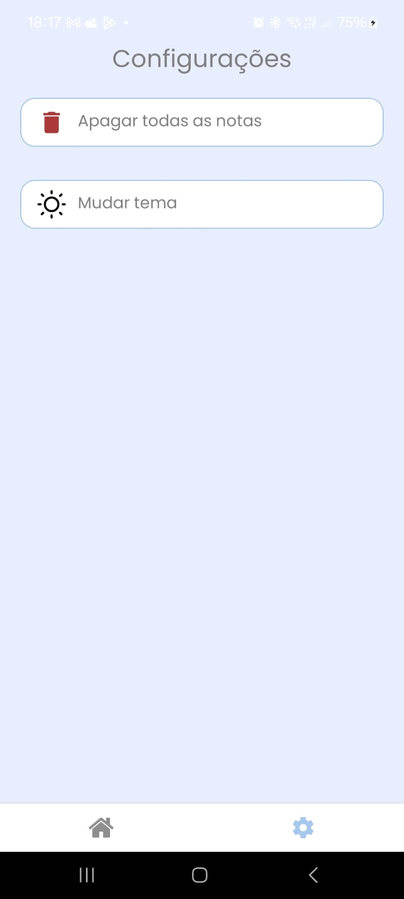
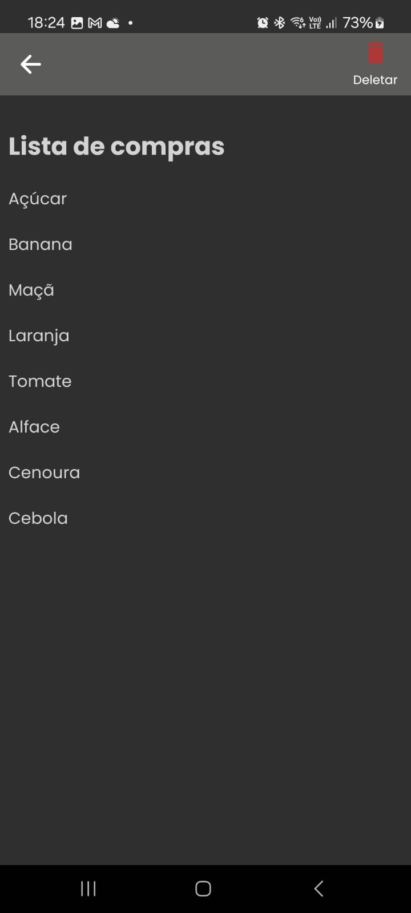

# Notkes
Notkes é um projeto desenvolvido para gerenciar notas de forma simples e eficiente. Ele permite que os usuários criem, editem e excluam notas, organizando-as de maneira intuitiva, onde tudo é salvo localmente. Este repositório contém o código-fonte.

  
  
   

Desenvolvido por 
<a href="https://github.com/dartres" target="_blank">Brenda Caroline</a> e
<a href="https://github.com/iCrowleySHR" target="_blank">Gustavo Gualda</a>
